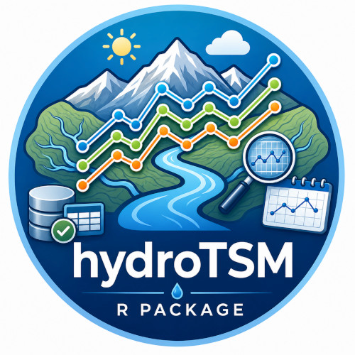

# hydroTSM

<!-- README badge block -->

[](https://doi.org/CRAN.package.hydroTSM)

[](https://www.gnu.org/licenses/old-licenses/gpl-2.0.html)
[](https://lifecycle.r-lib.org/articles/stages.html)
[](https://CRAN.R-project.org/package=hydroTSM)
[](https://hzambran.github.io/hydroTSM/)

[](https://github.com/hzambran/hydroTSM)
[](https://CRAN.R-project.org/package=hydroTSM)
[](https://github.com/hzambran/hydroTSM/actions/workflows/R-CMD-check.yaml)
[](https://cran.r-project.org/package=hydroTSM)
[](https://cran.r-project.org/package=hydroTSM)


## Description

[**hydroTSM**](https://cran.r-project.org/package=hydroTSM) is an R package designed to support the practical workflow of hydrologists and environmental scientists who routinely work with time series data. It provides a comprehensive and coherent set of tools for the management, quality control, analysis, interpolation, and visualization of hydrological and environmental time series, with particular emphasis on tasks commonly encountered in hydrological modelling and water resources assessment.

[**hydroTSM**](https://cran.r-project.org/package=hydroTSM) prioritises reliability, transparency, and functional breadth, reflecting the operational realities of applied hydrology, where reproducible data handling and robust diagnostics are often more critical than marginal computational gains. Its functions are built to integrate naturally into analytical pipelines, facilitating consistent preprocessing and exploration of observational datasets prior to modelling or decision-making.

Developed with the daily needs of practitioners in mind, [**hydroTSM**](https://cran.r-project.org/package=hydroTSM) has been widely used in research, teaching, and professional applications. It is especially suitable for users who require dependable, well-documented tools to support routine hydrological analysis while maintaining full control over data processing steps within the R environment.





## Installation

Installing the latest stable version from [CRAN](https://CRAN.R-project.org/package=hydroTSM):

```
install.packages("hydroTSM")
```


Alternatively, you can also try the under-development version from [Github](https://github.com/hzambran/hydroTSM):

```
if (!require(devtools)) install.packages("devtools")

library(devtools)

install_github("hzambran/hydroTSM")
```

## Reporting bugs, requesting new features

If you find an error in some function, or want to report a typo in the documentation, or to request a new feature (and wish it be implemented :) you can do it [here](https://github.com/hzambran/hydroTSM/issues)


## Citation 

```
citation("hydroTSM")
```

To cite hydroTSM in publications use:

> Zambrano-Bigiarini, Mauricio (2026). hydroTSM: Time Series Management and Analysis for Hydrological Modelling. R package version 0.8-4. URL:https://CRAN.R-project.org/package=hydroTSM. doi:10.32614/CRAN.package.hydroTSM.


A BibTeX entry for LaTeX users is

>  @Manual{hydroTSM,  
>    title = {hydroTSM: Time Series Management, Analysis and Interpolation for Hydrological Modelling},  
>    author = {Zambrano-Bigiarini, Mauricio},  
>    note = {R package version 0.8-4},  
>    year = {2026},
>    url = {https://CRAN.R-project.org/package=hydroTSM},  
>    doi = {doi:10.32614/CRAN.package.hydroTSM},  
>  }


## Vignettes

1. [Daily precipitation](https://cran.r-project.org/package=hydroTSM/vignettes/hydroTSM_Daily_P_Vignette-knitr.pdf). Here you can find an introductory vignette showing the use of several hydroTSM functions for analysing daily precipitation data.

2. [Daily streamflows](https://cran.r-project.org/package=hydroTSM/vignettes/hydroTSM_Daily_Q_Vignette-knitr.pdf). Here you can find an introductory vignette showing the use of several hydroTSM functions for analysing daily streamflow data.


## Related Material 

* *R: a statistical environment for hydrological analysis* (**EGU-2010**)  [abstract](http://meetingorganizer.copernicus.org/EGU2010/EGU2010-13008.pdf), [poster](http://www.slideshare.net/hzambran/egu2010-ra-statisticalenvironmentfordoinghydrologicalanalysis-9095709).

* *Using R for analysing spatio-temporal datasets: a satellite-based precipitation case study* (**EGU-2017**) [abstract](http://meetingorganizer.copernicus.org/EGU2017/EGU2017-18343.pdf), [poster](https://doi.org/10.5281/zenodo.570145).


## See Also 

* [**hydroGOF**: Goodness-of-fit functions for comparison of simulated and observed hydrological time series](https://cran.r-project.org/package=hydroGOF).

* [**hydroMOPSO**: Multi-Objective Optimisation with Focus on Environmental Models](https://cran.r-project.org/package=hydroMOPSO).

* [**hydroPSO**: Model-independent Particle Swarm Optimisation (PSO) for environmental/hydrological models](https://cran.r-project.org/package=hydroPSO).

* [**RFmerge**: Merging of Satellite Datasets with Ground Observations using Random Forests](https://cran.r-project.org/package=RFmerge).
