# Introductory analysis of daily precipitation with hydroTSM

## Citation

If you use *[hydroTSM](https://CRAN.R-project.org/package=hydroTSM)*,
please cite it as Zambrano-Bigiarini (2025):

Zambrano-Bigiarini, Mauricio (2025). hydroTSM: Time Series Management
and Analysis for Hydrological Modelling. R package version 0.8-0.
URL:<https://CRAN.R-project.org/package=hydroTSM>.
<doi:10.32614/CRAN.package.hydroTSM>.

## Installation

Installing the latest stable version (from
[CRAN](https://CRAN.R-project.org/package=hydroTSM)):

``` r
install.packages("hydroTSM")
```

Alternatively, you can also try the under-development version (from
[Github](https://github.com/hzambran/hydroTSM)):

``` r
if (!require(devtools)) install.packages("devtools")
library(devtools)
install_github("hzambran/hydroTSM")
```

## Setting up the environment

Loading the *hydroTSM* package, which contains data and functions used
in this analysis:

``` r
library(hydroTSM)
```

    ## Loading required package: zoo

    ## 
    ## Attaching package: 'zoo'

    ## The following objects are masked from 'package:base':
    ## 
    ##     as.Date, as.Date.numeric

Loading daily precipitation data at the station San Martino di
Castrozza, Trento Province, Italy, from 01/Jan/1921 to 31/Dec/1990.

``` r
data(SanMartinoPPts)
```

Selecting only a 6-years time slice for the analysis

``` r
x <- window(SanMartinoPPts, start="1985-01-01")
```

Dates of the daily values of ‘x’

``` r
dates <- time(x)
```

Amount of years in ‘x’ (needed for computations)

``` r
( nyears <- yip(from=start(x), to=end(x), out.type="nmbr" ) )
```

    ## [1] 6

## Basic exploratory data analysis (EDA)

1.  Summary statistics

``` r
smry(x)
```

    ##               Index         x
    ## Min.     1985-01-01    0.0000
    ## 1st Qu.  1986-07-02    0.0000
    ## Median   1988-01-01    0.0000
    ## Mean     1988-01-01    3.7470
    ## 3rd Qu.  1989-07-01    2.6000
    ## Max.     1990-12-31  122.0000
    ## IQR            <NA>    2.6000
    ## sd             <NA>   10.0428
    ## cv             <NA>    2.6800
    ## Skewness       <NA>    5.3512
    ## Kurtosis       <NA>   39.1619
    ## NA's           <NA>    0.0000
    ## n              <NA> 2191.0000

2.  Amount of days with information (not NA) per year

``` r
dwi(x)
```

    ## 1985 1986 1987 1988 1989 1990 
    ##  365  365  365  366  365  365

3.  Amount of days with information (not NA) per month per year

``` r
dwi(x, out.unit="mpy")
```

    ##      Jan Feb Mar Apr May Jun Jul Aug Sep Oct Nov Dec
    ## 1985  31  28  31  30  31  30  31  31  30  31  30  31
    ## 1986  31  28  31  30  31  30  31  31  30  31  30  31
    ## 1987  31  28  31  30  31  30  31  31  30  31  30  31
    ## 1988  31  29  31  30  31  30  31  31  30  31  30  31
    ## 1989  31  28  31  30  31  30  31  31  30  31  30  31
    ## 1990  31  28  31  30  31  30  31  31  30  31  30  31

4.  Computation of monthly values only when the percentage of NAs in
    each month is lower than a user-defined percentage (10% in this
    example).

``` r
# Loading the DAILY precipitation data at SanMartino
data(SanMartinoPPts)
y <- SanMartinoPPts
     
# Subsetting 'y' to its first three months (Jan/1921 - Mar/1921)
y <- window(y, end="1921-03-31")
     
## Transforming into NA the 10% of values in 'y'
set.seed(10) # for reproducible results
n           <- length(y)
n.nas       <- round(0.1*n, 0)
na.index    <- sample(1:n, n.nas)
y[na.index] <- NA
     
## Daily to monthly, only for months with less than 10% of missing values
(m2 <- daily2monthly(y, FUN=sum, na.rm=TRUE, na.rm.max=0.1))
```

    ## 1921-01-01 1921-02-01 1921-03-01 
    ##        102         NA         NA

``` r
# Verifying that the second and third month of 'x' had 10% or more of missing values
cmv(y, tscale="month")
```

    ## 1921-01 1921-02 1921-03 
    ##   0.065   0.107   0.129

4.  Basic exploratory figures:

Using the *hydroplot* function, which (by default) plots 9 different
graphs: 3 ts plots, 3 boxplots and 3 histograms summarizing ‘x’. For
this example, only daily and monthly plots are produced, and only data
starting on 01-Jan-1987 are plotted.

``` r
hydroplot(x, var.type="Precipitation", main="at San Martino", 
          pfreq = "dm", from="1987-01-01")
```

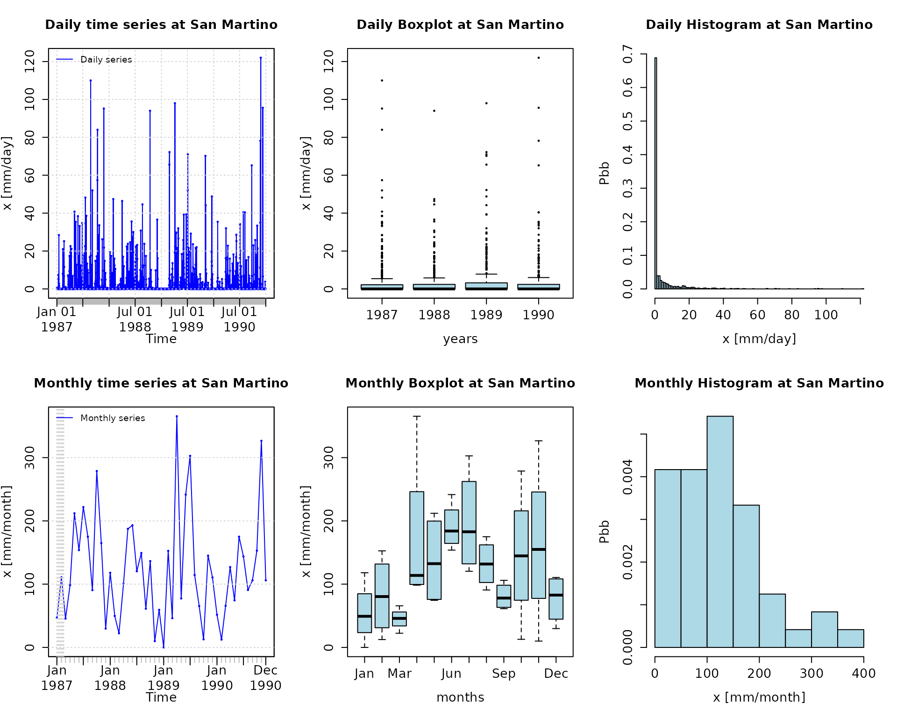

Global view of daily precipitation values a calendar heatmap (six years
maximum), useful for visually identifying dry, normal and wet days:

``` r
calendarHeatmap(x)
```

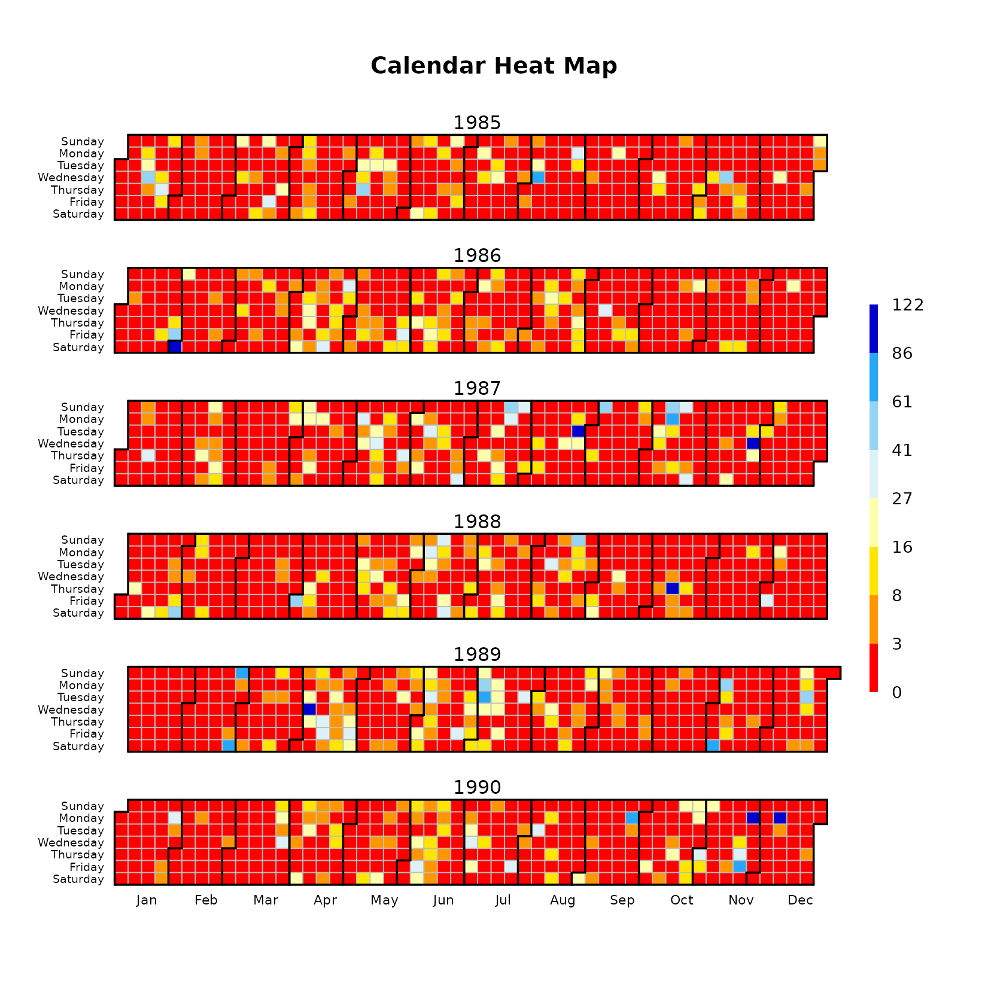

For each month, the previous figure is read from top to bottom. For
example, January 1st 1987 was Thursday, January 31th 1987 was Saturday
and November 1st 1990 was Thursday.

Selecting only a three-month time slice for the analysis:

``` r
yy <- window(SanMartinoPPts, start="1990-10-01")
```

Plotting the selected time series:

``` r
hydroplot(yy,  ptype="ts", pfreq="o", var.unit="mm")
```

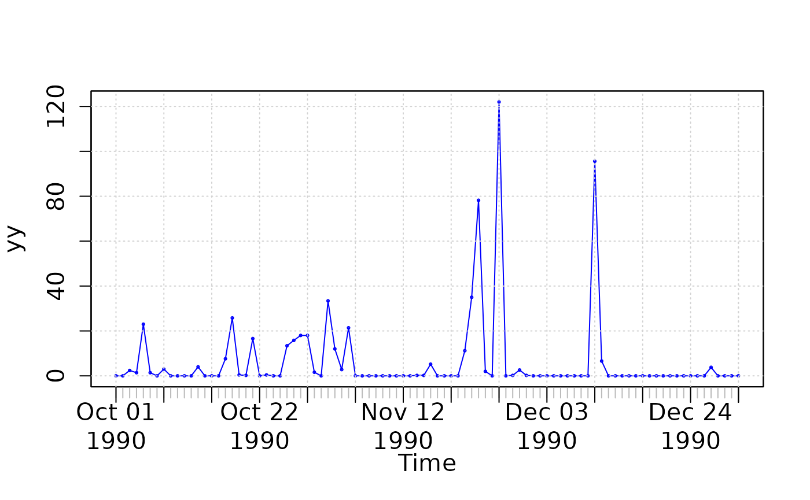

## Annual analysis

Annual values of precipitation

``` r
daily2annual(x, FUN=sum, na.rm=TRUE)
```

    ##   1985   1986   1987   1988   1989   1990 
    ## 1154.8 1152.8 1628.4 1207.8 1634.2 1432.4

Average annual precipitation

Obvious way:

``` r
mean( daily2annual(x, FUN=sum, na.rm=TRUE) )
```

    ## [1] 1368.4

Another way (more useful for streamflows, where `FUN=mean`):

The function *annualfunction* applies `FUN` twice over `x`:

( i) firstly, over all the elements of `x` belonging to the same year,
in order to obtain the corresponding annual values, and (ii) secondly,
over all the annual values of `x` previously obtained, in order to
obtain a single annual value.

``` r
annualfunction(x, FUN=sum, na.rm=TRUE) / nyears
```

    ##  value 
    ## 1368.4

## Monthly analysis

1.  Plotting the monthly precipitation values for each year, useful for
    identifying dry/wet months.

``` r
# Daily zoo to monthly zoo
m <- daily2monthly(x, FUN=sum, na.rm=TRUE)
     
# Creating a matrix with monthly values per year in each column
M <- matrix(m, ncol=12, byrow=TRUE)
colnames(M) <- month.abb
rownames(M) <- unique(format(time(m), "%Y"))
     
# Plotting the monthly precipitation values
require(lattice)
```

    ## Loading required package: lattice

``` r
print(matrixplot(M, ColorRamp="Precipitation", 
           main="Monthly precipitation at San Martino st., [mm/month]"))
```

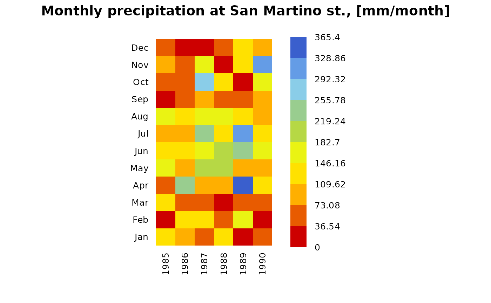

2.  Median of the monthly values at station ‘x’. Not needed, just for
    looking at these values in the boxplot.

``` r
monthlyfunction(m, FUN=median, na.rm=TRUE)
```

    ##   Jan   Feb   Mar   Apr   May   Jun   Jul   Aug   Sep   Oct   Nov   Dec 
    ##  63.7  80.4  52.9 113.8 141.9 164.4 132.1 145.1  67.6  97.4 123.4  57.1

3.  Vector with the three-letter abbreviations for the month names

``` r
cmonth <- format(time(m), "%b")
```

4.  Creating ordered monthly factors

``` r
months <- factor(cmonth, levels=unique(cmonth), ordered=TRUE)
```

5.  Boxplot of the monthly values

``` r
boxplot( coredata(m) ~ months, col="lightblue", main="Monthly Precipitation", 
         ylab="Precipitation, [mm]", xlab="Month")
```

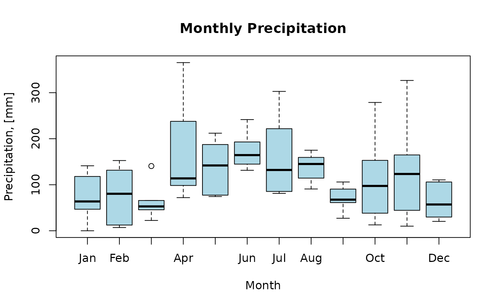

## Seasonal analysis

Average seasonal values of precipitation

``` r
seasonalfunction(x, FUN=sum, na.rm=TRUE) / nyears
```

    ##      DJF      MAM      JJA      SON 
    ## 213.1333 369.4000 470.8000 315.0667

Extracting the seasonal values for each year

``` r
( DJF <- dm2seasonal(x, season="DJF", FUN=sum) )
```

    ##  1985  1986  1987  1988  1989  1990 
    ## 148.2 262.2 178.2 197.6 212.0 174.6

``` r
( MAM <- dm2seasonal(m, season="MAM", FUN=sum) )
```

    ##  1985  1986  1987  1988  1989  1990 
    ## 388.2 405.6 356.0 310.4 489.0 267.2

``` r
( JJA <- dm2seasonal(m, season="JJA", FUN=sum) )
```

    ##  1985  1986  1987  1988  1989  1990 
    ## 376.2 367.0 550.6 462.6 658.8 409.6

``` r
( SON <- dm2seasonal(m, season="SON", FUN=sum) )
```

    ##  1985  1986  1987  1988  1989  1990 
    ## 187.4 152.4 534.2 207.6 223.2 585.6

Plotting the time evolution of the seasonal precipitation values

``` r
hydroplot(x, pfreq="seasonal", FUN=sum, stype="default")
```

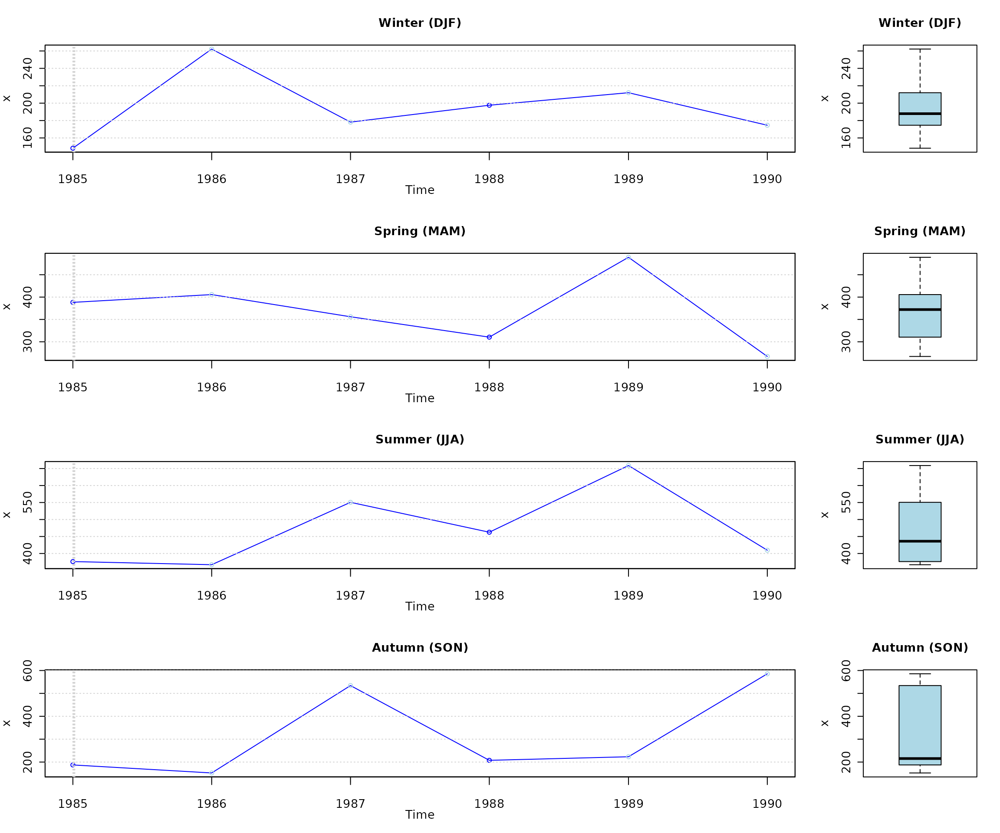

## Some extreme indices

Common steps for the analysis of this section:

Loading daily precipitation data at the station San Martino di
Castrozza, Trento Province, Italy, with data from 01/Jan/1921 to
31/Dec/1990.

``` r
data(SanMartinoPPts)
```

Selecting only a 6-year time slice for the analysis

``` r
x <- window(SanMartinoPPts, start="1985-10-01")
```

Plotting the selected time series

``` r
hydroplot(x,  ptype="ts", pfreq="o", var.unit="mm")
```

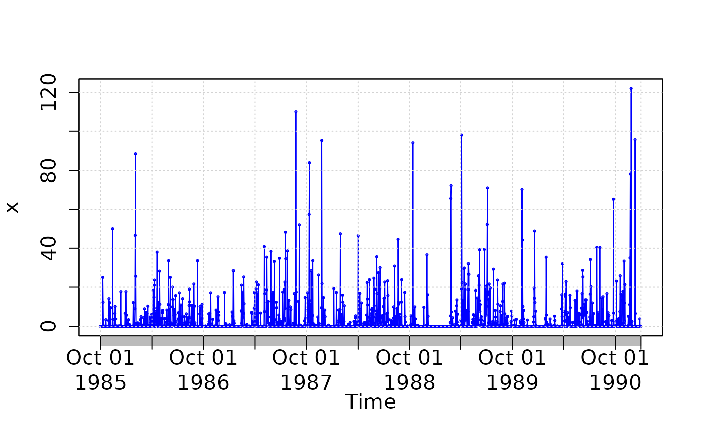

### Seasonality index

Computing the seasonality index defined by Walsh and Lawler (1981) to
classify the precipitation regime of `x`:

``` r
si(x)
```

    ## [1] 0.3483115

According to the seasonality index defined by Walsh and Lawler (1981), a
value of 0.35 corresponds to a precipitation regime that can be
classified as “Equable but with a definite wetter season” (see more
details with
[`?si`](https://hzambran.github.io/hydroTSM/reference/si.md)).

### Heavy precipitation days (R10mm)

Counting and plotting the number of days in the period where
precipitation is \> 10 \[mm\]:

``` r
( R10mm <- length( x[x>10] ) )
```

    ## [1] 220

### Very wet days (R95p)

Identifying the wet days (daily precipitation \>= 1 mm):

``` r
wet.index <- which(x >= 1)
```

Computing the 95th percentile of precipitation on wet days (*PRwn95*):

``` r
( PRwn95 <- quantile(x[wet.index], probs=0.95, na.rm=TRUE) )
```

    ##  95% 
    ## 38.4

**Note 1**: this computation was carried out for the three-year time
period 1988-1990, not the 30-year period 1961-1990 commonly used.

**Note 2**: missing values are removed from the computation.

Identifying the very wet days (daily precipitation \>= *PRwn95*):

``` r
(very.wet.index <- which(x >= PRwn95))
```

    ##  [1]   44  123  124  581  605  657  664  694  706  741  742  786  852  914 1056
    ## [16] 1109 1244 1245 1283 1345 1362 1372 1373 1496 1498 1541 1761 1772 1820 1880
    ## [31] 1883 1897

Computing the total precipitation on the very wet days:

``` r
( R95p <- sum(x[very.wet.index]) )
```

    ## [1] 2024.8

**Note 3**: this computation was carried out for the three-year time
period 1988-1990, not the 30-year period 1961-1990 commonly used

### 5-day total precipitation

Computing the 5-day total (accumulated) precipitation:

``` r
x.5max <- rollapply(data=x, width=5, FUN=sum, fill=NA, partial= TRUE, 
                    align="center")

hydroplot(x.5max,  ptype="ts+boxplot", pfreq="o", var.unit="mm")
```

    ## [Note: pfreq='o' => ptype has been changed to 'ts']

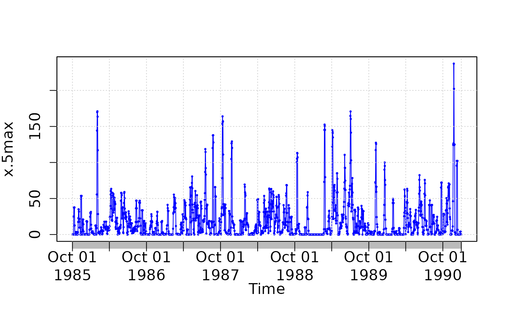

Maximum annual value of 5-day total precipitation:

``` r
(x.5max.annual <- daily2annual(x.5max, FUN=max, na.rm=TRUE))
```

    ## 1985-11-12 1986-02-01 1987-10-11 1988-10-13 1989-07-03 1990-11-24 
    ##       53.6      171.0      164.0      113.2      170.8      237.2

**Note 1**: for this computation, a moving window centred in the current
day is used. If the user wants the 5-day total precipitation accumulated
in the 4 days before the current day + the precipitation in the current
day, the user have to modify the moving window.

**Note 2**: For the first two and last two values, the width of the
window is adapted to ignore values not within the time series

## Climograph

Since v0.5-0, `hydroTSM` includes a function to plot a climograph,
considering not only precipitation but air temperature data as well.

``` r
# Loading daily ts of precipitation, maximum and minimum temperature
data(MaquehueTemuco)

# extracting individual ts of precipitation, maximum and minimum temperature
pcp <- MaquehueTemuco[, 1]
tmx <- MaquehueTemuco[, 2]
tmn <- MaquehueTemuco[, 3]
```

Plotting a full climograph:

``` r
m <- climograph(pcp=pcp, tmx=tmx, tmn=tmn, na.rm=TRUE, 
                main="Maquehue Temuco Ad (Chile)", lat=-38.770, lon=-72.637)
```

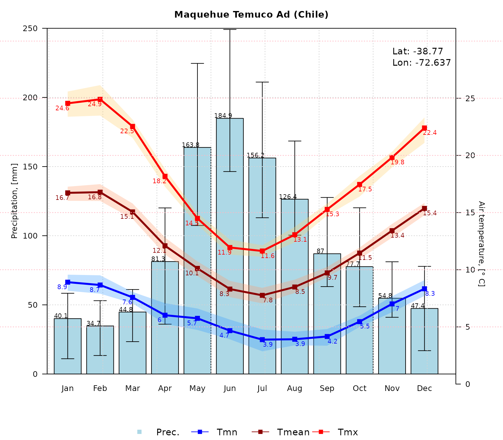

Plotting a climograph with uncertainty bands around mean values, but
with no labels for tmx and tmn:

``` r
m <- climograph(pcp=pcp, tmx=tmx, tmn=tmn, na.rm=TRUE, tmx.labels=FALSE, tmn.labels=FALSE, 
                main="Maquehue Temuco Ad (Chile)", lat=-38.770, lon=-72.637)
```


Plotting a climograph with uncertainty bands around mean values, but
with no labels for tmx, tmn and pcp:

``` r
m <- climograph(pcp=pcp, tmx=tmx, tmn=tmn, na.rm=TRUE, 
                pcp.labels=FALSE, tmean.labels=FALSE, tmx.labels=FALSE, tmn.labels=FALSE, 
                main="Maquehue Temuco Ad (Chile)", lat=-38.770, lon=-72.637)
```

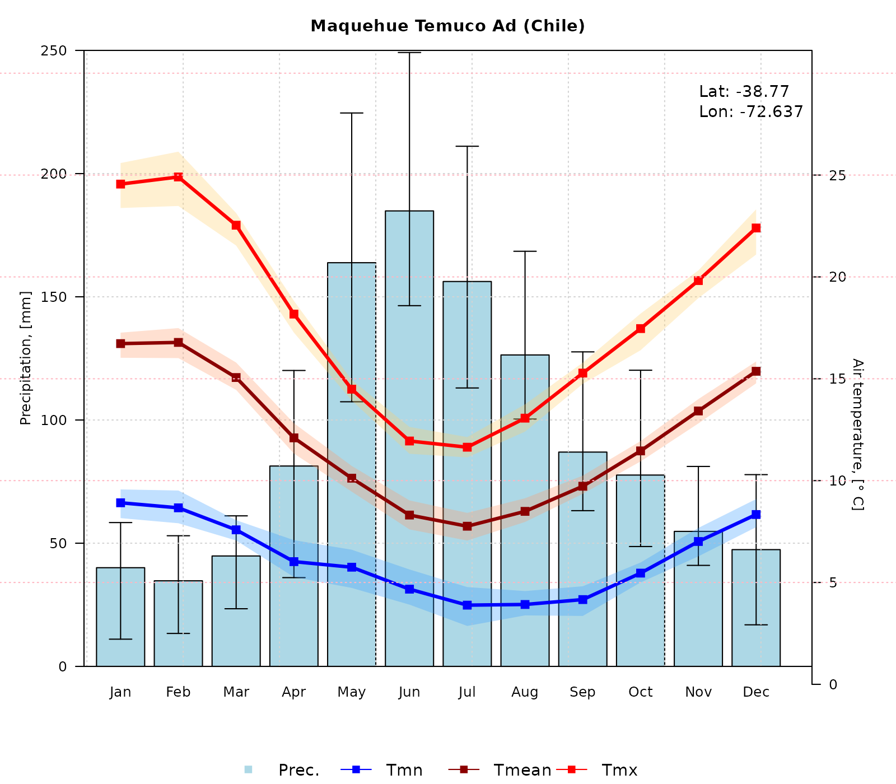

To better represent the hydrological year in Chile (South America), the
following figure will plot a full climograph starting in April
(`start.month=4`) instead of January (`start.month=1`):

``` r
m <- climograph(pcp=pcp, tmx=tmx, tmn=tmn, na.rm=TRUE, 
                start.month=4, temp.labels.dx=c(rep(-0.2,4), rep(0.2,6),rep(-0.2,2)),
                main="Maquehue Temuco Ad (Chile)", lat=-38.770, lon=-72.637)
```

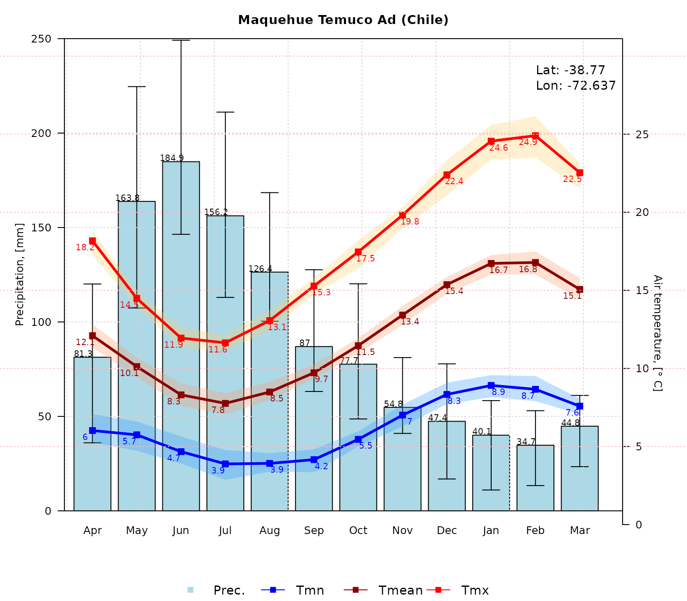

## Software details

This tutorial was built under:

    ## [1] "x86_64-pc-linux-gnu"

    ## [1] "R version 4.6.0 (2026-04-24)"

    ## [1] "hydroTSM 0.8-6"

## Version history

- v1.0: 27-Dec-2025
- v0.9: 21-Jan-2024
- v0.8: Nov 2023
- v0.7: Mar 2020
- v0.6: Aug 2017
- v0.5: May 2013
- v0.4: Aug 2011
- v0.3: Apr 2011
- v0.2: Oct 2010
- v0.1: 30-May-2013

## Appendix

In order to make easier the use of for users not familiar with R, in
this section a minimal set of information is provided to guide the user
in the [R](https://www.r-project.org/) world.

### Editors, GUI

- **Multi-platform**: [Sublime Text](https://www.sublimetext.com/)
  (<https://www.sublimetext.com/>) ; [RStudio](https://posit.co/)
  (<https://posit.co/>)

- **GNU/Linux only**: [ESS](https://ess.r-project.org/)
  (<https://ess.r-project.org/>)

- **Windows only** : [NppToR](https://sourceforge.net/projects/npptor/)
  (<https://sourceforge.net/projects/npptor/>)

### Importing data

- [`?read.table`](https://rdrr.io/r/utils/read.table.html),
  [`?write.table`](https://rdrr.io/r/utils/write.table.html): allow the
  user to read/write a file (in $\ $table format) and create a data
  frame from it. Related functions are
  [`?read.csv`](https://rdrr.io/r/utils/read.table.html),
  [`?write.csv`](https://rdrr.io/r/utils/write.table.html),
  [`?read.csv2`](https://rdrr.io/r/utils/read.table.html),
  [`?write.csv2`](https://rdrr.io/r/utils/write.table.html).

- [`?zoo::read.zoo`](https://rdrr.io/pkg/zoo/man/read.zoo.html),
  [`?zoo::write.zoo`](https://rdrr.io/pkg/zoo/man/read.zoo.html):
  functions for reading and writing time series from/to text files,
  respectively.

- [**R Data
  Import/Export**](https://cran.r-project.org/doc/manuals/r-release/R-data.html):
  <https://cran.r-project.org/doc/manuals/r-release/R-data.html>

- [**foreign** R package](https://cran.r-project.org/package=foreign):
  read data stored in several R-external formats (dBase, Minitab, S,
  SAS, SPSS, Stata, Systat, Weka, …)

- [**readxl** R package](https://cran.r-project.org/package=readxl):
  Import MS Excel files into R.

- [**some examples**](https://www.datacamp.com/doc/r/importingdata):
  <https://www.datacamp.com/doc/r/importingdata>

### Useful Websites

- [**Quick
  R**](https://www.datacamp.com/doc/r/category/r-documentation):
  <https://www.datacamp.com/doc/r/category/r-documentation>

- [**Time series in R**](https://cran.r-project.org/view=TimeSeries):
  <https://cran.r-project.org/view=TimeSeries>

- [**Quick reference for the `zoo`
  package**](https://cran.r-project.org/package=zoo/vignettes/zoo-quickref.pdf):
  <https://cran.r-project.org/package=zoo/vignettes/zoo-quickref.pdf>

### F.A.Q.

## How to print more than one `matrixplot` in a single Figure?

Because `matrixplot` is based on lattice graphs, normal plotting
commands included in base R does not work. Therefore, for plotting ore
than 1 matrixplot in a single figure, you need to save the individual
plots in an R object and then print them as you want.

In the following sequential lines of code, you can see two examples that
show you how to plot two matrixplots in a single Figure:

``` r
library(hydroTSM)
data(SanMartinoPPts)
x <- window(SanMartinoPPts, end=as.Date("1960-12-31"))
m <- daily2monthly(x, FUN=sum, na.rm=TRUE)
M <- matrix(m, ncol=12, byrow=TRUE)
colnames(M) <- month.abb
rownames(M) <- unique(format(time(m), "%Y"))
p <- matrixplot(M, ColorRamp="Precipitation", main="Monthly precipitation,")

print(p, position=c(0, .6, 1, 1), more=TRUE)
print(p, position=c(0, 0, 1, .4))
```


The second and easier way allows you to obtain the same previous figure
(not shown here), but you are required to install the `gridExtra`
package:

``` r
if (!require(gridExtra)) install.packages("gridExtra")
```

    ## Loading required package: gridExtra

``` r
require(gridExtra) # also loads grid
require(lattice)

grid.arrange(p, p, nrow=2)
```

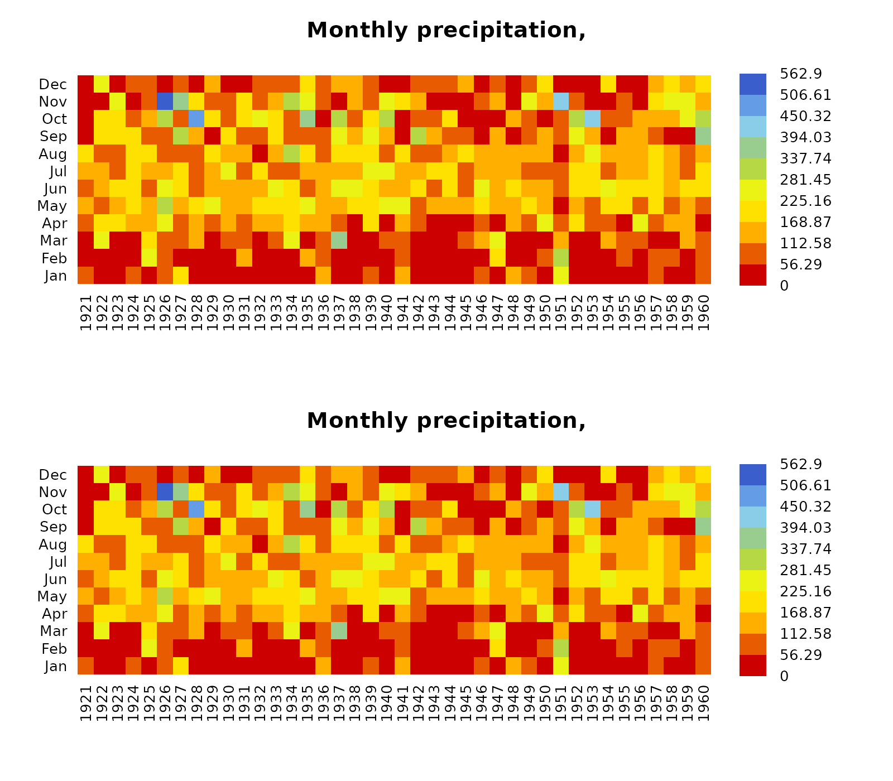
