# Introductory analysis of daily streamflows with hydroTSM

## Citation

If you use *[hydroTSM](https://cran.r-project.org/package=hydroTSM)*,
please cite it as Zambrano-Bigiarini (2024):

Zambrano-Bigiarini, Mauricio (2024). hydroTSM: Time Series Management
and Analysis for Hydrological Modelling. R package version 0.7-0.
URL:<https://cran.r-project.org/package=hydroTSM>.
<doi:10.5281/zenodo.839565>.

## Installation

Installing the latest stable version (from
[CRAN](https://cran.r-project.org/package=hydroTSM)):

``` r
install.packages("hydroTSM")
```

Alternatively, you can also try the under-development version (from
[Github](https://github.com/hzambran/hydroTSM)):

``` r
if (!require(devtools)) install.packages("devtools")
library(devtools)
install_github("hzambran/hydroTSM")
```

## Setting up the environment

Loading the *hydroTSM* package, which contains data and functions used
in this analysis:

``` r
library(hydroTSM)
```

    ## Loading required package: zoo

    ## 
    ## Attaching package: 'zoo'

    ## The following objects are masked from 'package:base':
    ## 
    ##     as.Date, as.Date.numeric

Loading daily streamflow data at the station Cauquenes en el Arrayan,
Maule Region, Chile, from 01/Jan/1979 to 31/Dec/2020.

``` r
data(Cauquenes7336001)
```

Selecting only a 30-years time slice for the analysis

``` r
x <- window(Cauquenes7336001, start="1981-01-01", end="2010-12-31")
```

Dates of the daily values of ‘x’:

``` r
dates <- time(x)
```

Amount of years in ‘x’ (needed for computations):

``` r
( nyears <- yip(from=start(x), to=end(x), out.type="nmbr" ) )
```

    ## [1] 30

The `Cauquenes7336001` dataset stores 5 variables (in this order): P,
\[mm\], Tmx, \[degC\], Tmn, \[deg C\], PET, \[mm\], Qobs, \[mm\], Qobs,
\[m3/s\]. For the rest of the analysis, only streamflows (Q, \[mm\]) and
precipitations (P, \[mm\]) will be selected:

``` r
P <- x[, 1]
Q <- x[, 5]
```

## Basic exploratory data analysis (EDA)

1.  Summary statistics of streamflows:

``` r
smry(Q)
```

    ##               Index          Q
    ## Min.     1981-01-01     0.0014
    ## 1st Qu.  1988-07-02     0.0583
    ## Median   1996-01-01     0.1708
    ## Mean     1996-01-01     1.2220
    ## 3rd Qu.  2003-07-02     0.8375
    ## Max.     2010-12-31   118.5000
    ## IQR            <NA>     0.7791
    ## sd             <NA>     4.1753
    ## cv             <NA>     3.4180
    ## Skewness       <NA>    11.2980
    ## Kurtosis       <NA>   190.5046
    ## NA's           <NA>   274.0000
    ## n              <NA> 10957.0000

2.  Amount of days with information (not NA) per year:

``` r
dwi(Q)
```

    ## 1981 1982 1983 1984 1985 1986 1987 1988 1989 1990 1991 1992 1993 1994 1995 1996 
    ##  363  364  363  365  365  364  365  366  365  365  359  326  365  365  297  366 
    ## 1997 1998 1999 2000 2001 2002 2003 2004 2005 2006 2007 2008 2009 2010 
    ##  365  337  365  366  365  365  365  366  365  348  365  305  318  365

3.  Amount of days with information (not NA) per month per year:

``` r
dwi(Q, out.unit="mpy")
```

    ##      Jan Feb Mar Apr May Jun Jul Aug Sep Oct Nov Dec
    ## 1981  31  28  31  30  31  29  30  31  30  31  30  31
    ## 1982  31  28  31  30  31  30  31  31  29  31  30  31
    ## 1983  31  28  31  30  31  29  30  31  30  31  30  31
    ## 1984  31  29  31  30  31  30  30  31  30  31  30  31
    ## 1985  31  28  31  30  31  30  31  31  30  31  30  31
    ## 1986  31  28  31  30  31  29  31  31  30  31  30  31
    ## 1987  31  28  31  30  31  30  31  31  30  31  30  31
    ## 1988  31  29  31  30  31  30  31  31  30  31  30  31
    ## 1989  31  28  31  30  31  30  31  31  30  31  30  31
    ## 1990  31  28  31  30  31  30  31  31  30  31  30  31
    ## 1991  31  26  31  30  31  30  27  31  30  31  30  31
    ## 1992  31  29  31  30  31  30  31  13   8  31  30  31
    ## 1993  31  28  31  30  31  30  31  31  30  31  30  31
    ## 1994  31  28  31  30  31  30  31  31  30  31  30  31
    ## 1995  31  28  25  15  20   5  20  31  30  31  30  31
    ## 1996  31  29  31  30  31  30  31  31  30  31  30  31
    ## 1997  31  28  31  30  31  30  31  31  30  31  30  31
    ## 1998  31  28  31  30  31  30  31  31  30  30  19  15
    ## 1999  31  28  31  30  31  30  31  31  30  31  30  31
    ## 2000  31  29  31  30  31  30  31  31  30  31  30  31
    ## 2001  31  28  31  30  31  30  31  31  30  31  30  31
    ## 2002  31  28  31  30  31  30  31  31  30  31  30  31
    ## 2003  31  28  31  30  31  30  31  31  30  31  30  31
    ## 2004  31  29  31  30  31  30  31  31  30  31  30  31
    ## 2005  31  28  31  30  31  30  31  31  30  31  30  31
    ## 2006  31  28  31  30  31  30  31  14  30  31  30  31
    ## 2007  31  28  31  30  31  30  31  31  30  31  30  31
    ## 2008  31  29  13   0  18  30  31  31  30  31  30  31
    ## 2009  31  28  31  30  31  30  24   0  21  31  30  31
    ## 2010  31  28  31  30  31  30  31  31  30  31  30  31

4.  Since v0.7-0, hydroTSM allows the computation of the
    amount/percentage of days with missing data in different temporal
    scales (e.g., hourly, weekly, seasonal). By default, the `cmv`
    function returns the percentage of missing values in the desired
    temporal scale using decimal values:

``` r
( pmd <- cmv(Q, tscale="monthly") )
```

    ## 1981-01 1981-02 1981-03 1981-04 1981-05 1981-06 1981-07 1981-08 1981-09 1981-10 
    ##   0.000   0.000   0.000   0.000   0.000   0.033   0.032   0.000   0.000   0.000 
    ## 1981-11 1981-12 1982-01 1982-02 1982-03 1982-04 1982-05 1982-06 1982-07 1982-08 
    ##   0.000   0.000   0.000   0.000   0.000   0.000   0.000   0.000   0.000   0.000 
    ##  [ reached 'max' / getOption("max.print") -- omitted 340 entries ]

Identifying months with more than 10 percent of missing data:

``` r
index <- which(pmd >= 0.1)
time(pmd[index])
```

    ##  [1] "1991-07" "1992-08" "1992-09" "1995-03" "1995-04" "1995-05" "1995-06"
    ##  [8] "1995-07" "1998-11" "1998-12" "2006-08" "2008-03" "2008-04" "2008-05"
    ## [15] "2009-07" "2009-08" "2009-09"

5.  Computation of monthly values only when the percentage of NAs in
    each month is lower than a user-defined percentage (10% in this
    example).

``` r
## Daily to monthly, only for months with less than 10% of missing values
(m2 <- daily2monthly(Q, FUN=mean, na.rm=TRUE, na.rm.max=0.1))
```

    ## 1981-01-01 1981-02-01 1981-03-01 1981-04-01 1981-05-01 1981-06-01 1981-07-01 
    ## 0.06963541 0.04992439 0.03557262 0.09975684 6.70602042 2.87502617 2.29693512 
    ## 1981-08-01 1981-09-01 1981-10-01 1981-11-01 1981-12-01 1982-01-01 1982-02-01 
    ## 1.72374858 1.75745744 0.35827986 0.18224559 0.08523987 0.05131148 0.04476578 
    ## 1982-03-01 1982-04-01 1982-05-01 1982-06-01 1982-07-01 1982-08-01 
    ## 0.03753045 0.04709608 3.75221201 8.93496883 7.40797474 4.60248712 
    ##  [ reached 'max' / getOption("max.print") -- omitted 340 entries ]

6.  Basic exploratory figures:

Using the *hydroplot* function, which (by default) plots 9 different
graphs: 3 ts plots, 3 boxplots and 3 histograms summarizing ‘x’. For
this example, only daily and monthly plots are produced, and only data
starting on 01-Jan-1987 are plotted.

``` r
hydroplot(Q, var.type="Flow", main="at Cauquenes en el Arrayan", 
          pfreq = "dm", from="2000-01-01")
```

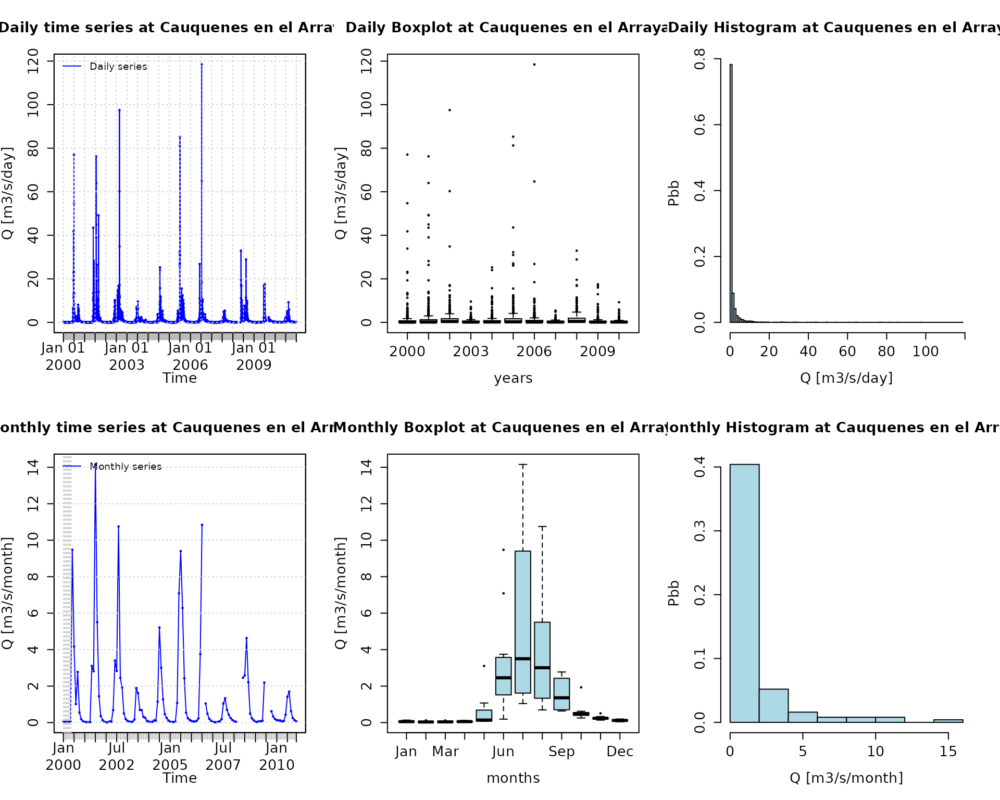

Plotting P and Q for the full time period of both time series:

``` r
plot_pq(p=P, q=Q)
```

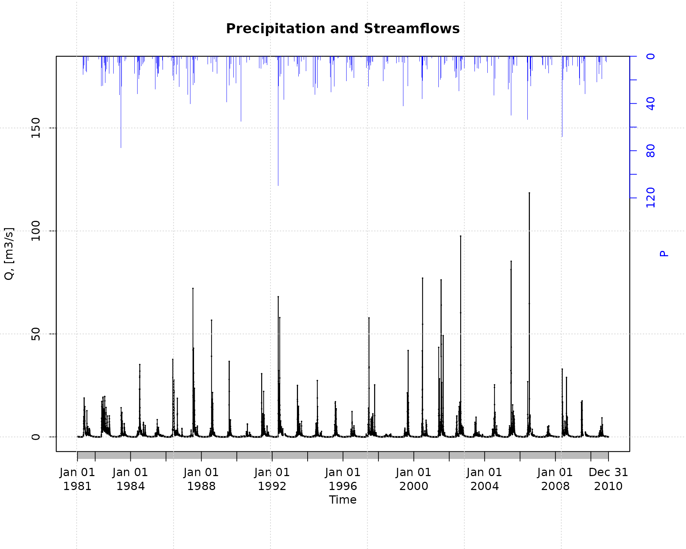

Plotting precipitation and streamflows only for a specific time period,
from April to December 2000:

``` r
plot_pq(p=P, q=Q, from="2000-04-01", to="2000-12-31")
```

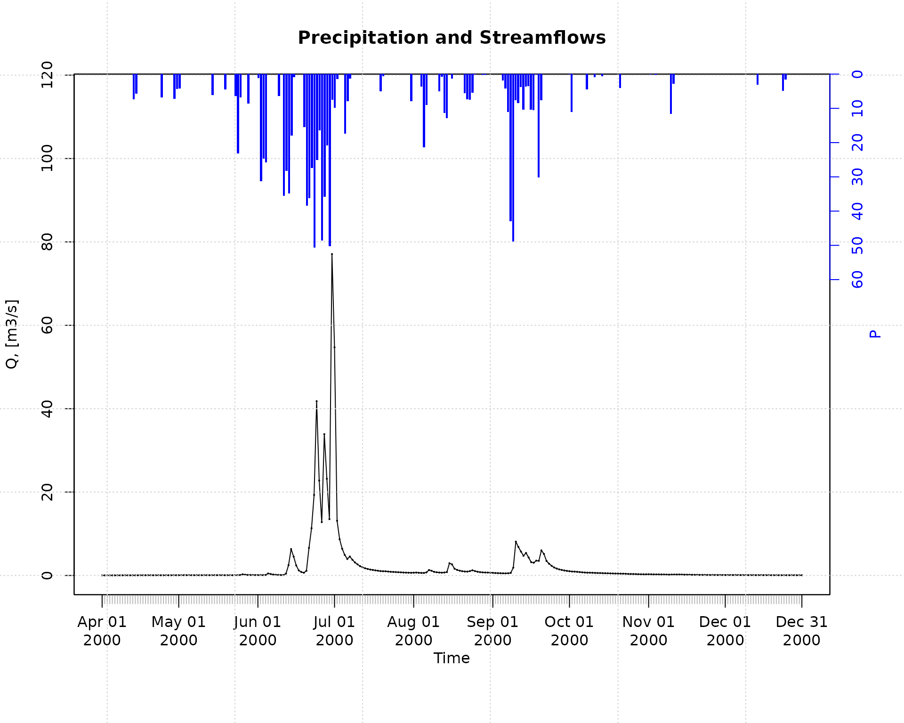

Plotting monthly values of precipitation and streamflows for the full
time period of both time series:

``` r
plot_pq(p=P, q=Q, ptype="monthly")
```

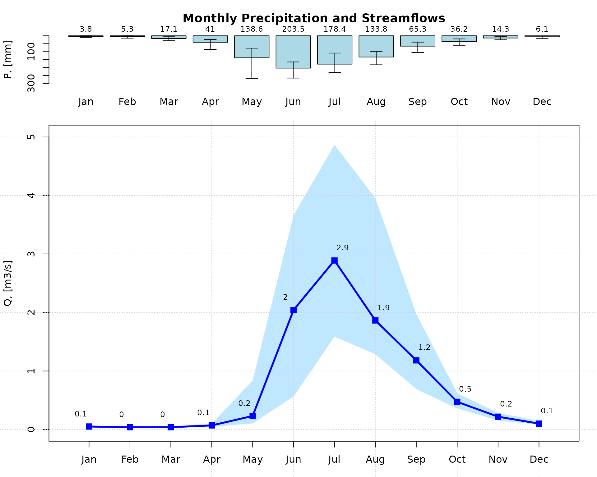

Plotting monthly values of precipitation and streamflows for the full
time period of both time series, but using a hydrologic year starting on
April:

``` r
plot_pq(p=P, q=Q, ptype="monthly", start.month=4)
```

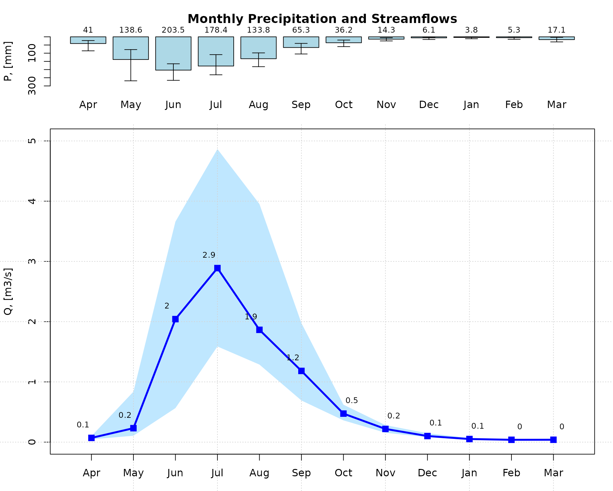

Selecting only a six-year time period for streamflows and then plotting
a calendar heatmap (six years maximum) to visually identify dry, normal
and wet days:

``` r
q <- window(Q, start="2005-01-01", end="2010-12-31")
calendarHeatmap(q)
```

    ## Warning in classInt::classIntervals(temp, n = length(col), dataPrecision =
    ## cuts.dec, : var has missing values, omitted in finding classes

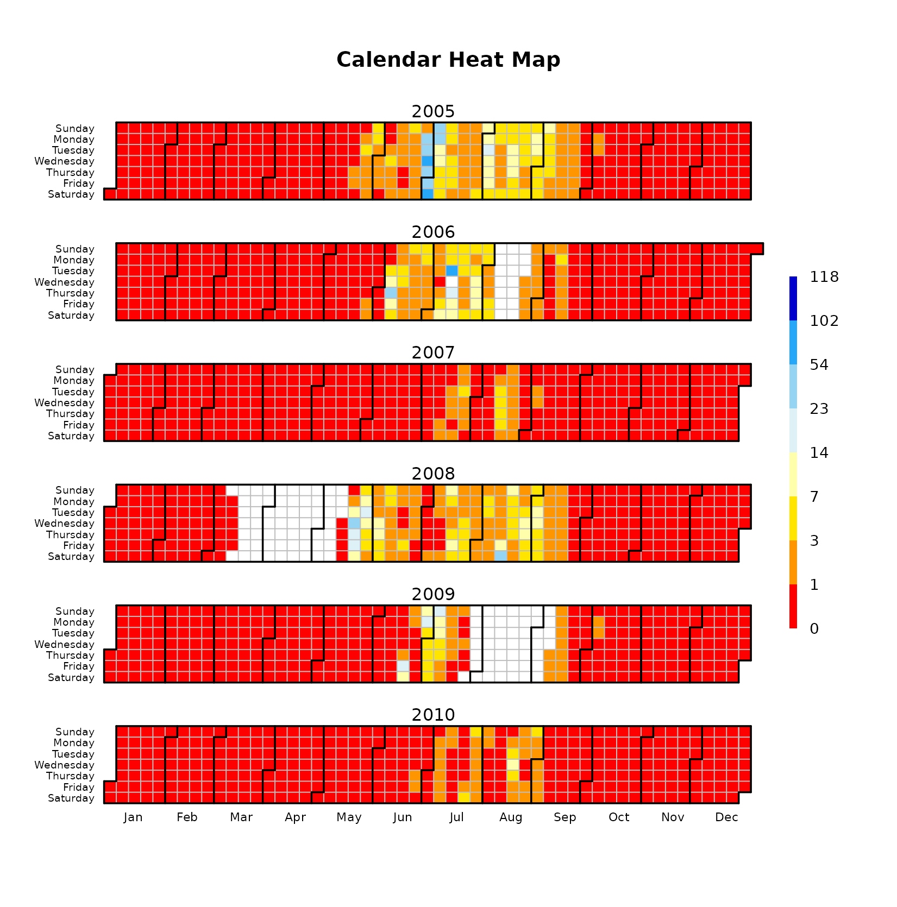

This figure allows to easily identify periods with missing data (e.g.,
Apr/2008 and Aug/2009). For each month, this figure is read from top to
bottom. For example, January 1st 2007 was Monday, January 31th 2007 was
Wednesday and October 1st 2010 was Friday.

## Flow duration curve (FDC)

Flow duration curve of the 30-year daily streamflow data using
logarithmic scale for the `y` axis (i.e., to put focus on the low
flows):

``` r
fdc2 <- fdc(Q)
```


Please note that `log="y"` was not provided as an argument to `fdc`
because it is the default value used in the function.

Flow duration curve of the 30-year daily streamflow data using
logarithmic scale for the `x` axis (i.e., to put focus on the high
flows):

``` r
fdc3 <- fdc(Q, log="x")
```


Traditional flow duration curve of the 30-year daily streamflow data:

``` r
fdc1 <- fdc(Q, log="", thr.pos="topright")
```


## Baseflow

Since v0.7-0, hydroTSM allows the computation of baseflow using the
filter proposed by Arnold and Allen (1999), which is based on earlier
work by Lyne and Hollick (1979).

This first exmaple illustrates the basic usage of the `baseflow`
function for computing and plotting the baseflow for the full time
period of a given time series of streamflows:

``` r
baseflow(Q) 
```

The previous code did not run because the streamflow time series has
some missing values. You might fill in the missing values using the
technique that you like the most and then call this function again. For
this example, we will use one of the two built-in techniques already
incorporated in the `baseflow` function the missing data, i.e.,
`na.fill="spline`:

``` r
baseflow(Q, na.fill="spline") 
```

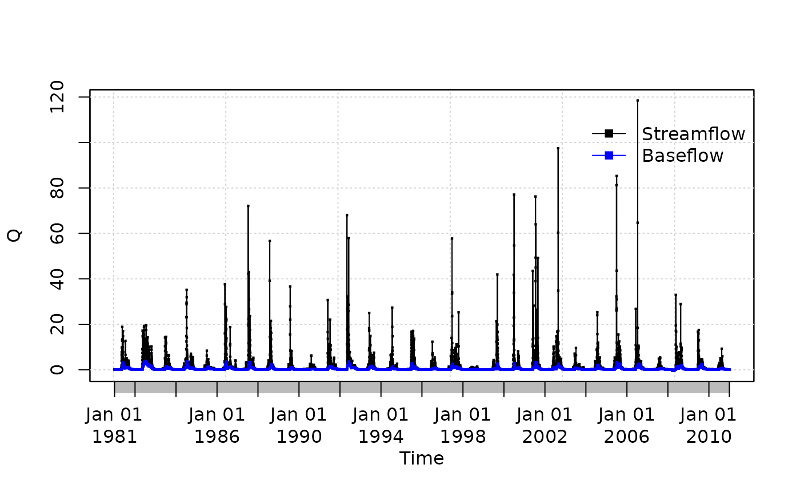

    ## 1981-01-01 1981-01-02 1981-01-03 1981-01-04 1981-01-05 1981-01-06 1981-01-07 
    ## 0.04583222 0.04595585 0.04629648 0.04675769 0.04722086 0.04762892 0.04797386 
    ## 1981-01-08 1981-01-09 1981-01-10 1981-01-11 1981-01-12 1981-01-13 1981-01-14 
    ## 0.04824942 0.04845012 0.04857058 0.04848719 0.04724127 0.04586267 0.04435630 
    ## 1981-01-15 1981-01-16 1981-01-17 1981-01-18 1981-01-19 1981-01-20 
    ## 0.04294380 0.04202268 0.04169691 0.04166566 0.04166566 0.04166566 
    ##  [ reached 'max' / getOption("max.print") -- omitted 10937 entries ]

Now, we will compute and plot the daily baseflow (i.e., the value
obtained after the thir pass of the filter) for the full time period:

``` r
baseflow(Q, na.fill="spline", plot=TRUE)
```

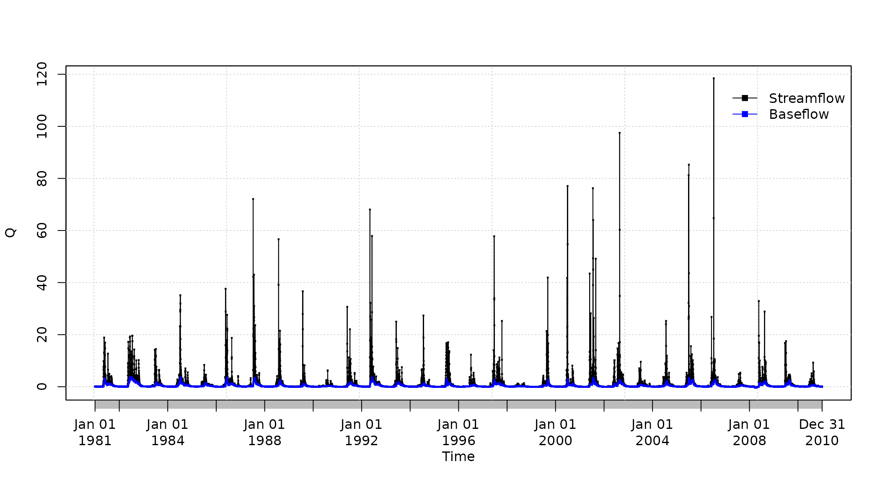

    ## 1981-01-01 1981-01-02 1981-01-03 1981-01-04 1981-01-05 1981-01-06 1981-01-07 
    ## 0.04583222 0.04595585 0.04629648 0.04675769 0.04722086 0.04762892 0.04797386 
    ## 1981-01-08 1981-01-09 1981-01-10 1981-01-11 1981-01-12 1981-01-13 1981-01-14 
    ## 0.04824942 0.04845012 0.04857058 0.04848719 0.04724127 0.04586267 0.04435630 
    ## 1981-01-15 1981-01-16 1981-01-17 1981-01-18 1981-01-19 1981-01-20 
    ## 0.04294380 0.04202268 0.04169691 0.04166566 0.04166566 0.04166566 
    ##  [ reached 'max' / getOption("max.print") -- omitted 10937 entries ]

You might also want to compute and plot the daily baseflow for a
specific time period. For this example, from April to December 2000:

``` r
baseflow(Q, na.fill="spline", from="2000-04-01", to="2000-12-31")
```

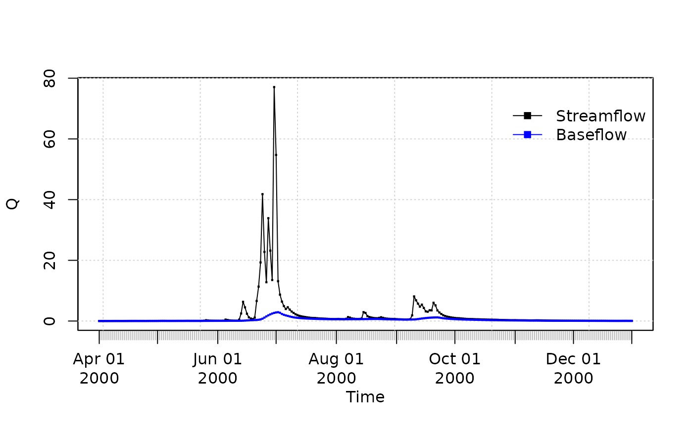

    ## 2000-04-01 2000-04-02 2000-04-03 2000-04-04 2000-04-05 2000-04-06 2000-04-07 
    ## 0.01055530 0.01058421 0.01066581 0.01079262 0.01096092 0.01117236 0.01143301 
    ## 2000-04-08 2000-04-09 2000-04-10 2000-04-11 2000-04-12 2000-04-13 2000-04-14 
    ## 0.01174777 0.01212483 0.01257104 0.01307664 0.01362143 0.01419277 0.01478636 
    ## 2000-04-15 2000-04-16 2000-04-17 2000-04-18 2000-04-19 2000-04-20 
    ## 0.01540326 0.01605655 0.01675997 0.01751794 0.01833122 0.01919427 
    ##  [ reached 'max' / getOption("max.print") -- omitted 255 entries ]

You might want to compute and plot the three daily baseflows (one for
each pass of the filter), for a specific time period (April to December
2000):

``` r
baseflow(Q, na.fill="spline", from="2000-04-01", to="2000-12-31", 
         out.type="all", plot=TRUE)
```

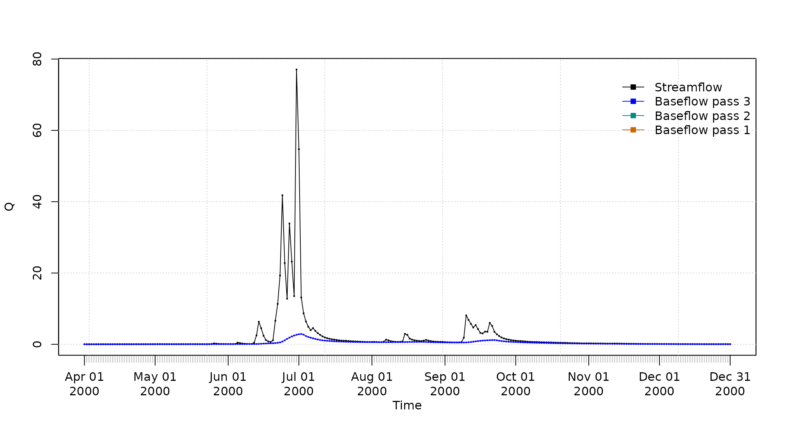

    ##                                             
    ## 2000-04-01  0.01055530 0.01055530 0.01055530
    ## 2000-04-02  0.01132611 0.01132611 0.01058421
    ## 2000-04-03  0.01201829 0.01201829 0.01066581
    ## 2000-04-04  0.01269500 0.01269500 0.01079262
    ## 2000-04-05  0.01337825 0.01337825 0.01096092
    ## 2000-04-06  0.01418213 0.01418213 0.01117236
    ##  [ reached 'max' / getOption("max.print") -- omitted 269 rows ]

## Software details

This tutorial was built under:

    ## [1] "x86_64-pc-linux-gnu"

    ## [1] "R version 4.6.0 (2026-04-24)"

    ## [1] "hydroTSM 0.8-4"

## Version history

-) v0.30: 27-Dec-2025

-) v0.20: 21-Jan-2024

-) v0.01: 2009

## Appendix

In order to make easier the use of for users not familiar with R, in
this section a minimal set of information is provided to guide the user
in the [R](https://www.r-project.org/) world.

### Editors, GUI

- **Multi-platform**: [Sublime Text](https://www.sublimetext.com/)
  (<https://www.sublimetext.com/> ; [RStudio](https://posit.co/)
  (<https://posit.co/>)

- **GNU/Linux only**: [ESS](https://ess.r-project.org/)
  (<https://ess.r-project.org/>)

- **Windows only** : [NppToR](https://sourceforge.net/projects/npptor/)
  (<https://sourceforge.net/projects/npptor/>)

### Importing data

- [`?read.table`](https://rdrr.io/r/utils/read.table.html),
  [`?write.table`](https://rdrr.io/r/utils/write.table.html): allow the
  user to read/write a file (in $\ $table format) and create a data
  frame from it. Related functions are
  [`?read.csv`](https://rdrr.io/r/utils/read.table.html),
  [`?write.csv`](https://rdrr.io/r/utils/write.table.html),
  [`?read.csv2`](https://rdrr.io/r/utils/read.table.html),
  [`?write.csv2`](https://rdrr.io/r/utils/write.table.html).

- [`?zoo::read.zoo`](https://rdrr.io/pkg/zoo/man/read.zoo.html),
  [`?zoo::write.zoo`](https://rdrr.io/pkg/zoo/man/read.zoo.html):
  functions for reading and writing time series from/to text files,
  respectively.

- [**R Data
  Import/Export**](https://CRAN.R-project.org/doc/manuals/r-release/R-data.html):
  <https://CRAN.R-project.org/doc/manuals/r-release/R-data.html>

- [**foreign** R package](https://CRAN.R-project.org/package=foreign):
  read data stored in several R-external formats (dBase, Minitab, S,
  SAS, SPSS, Stata, Systat, Weka, …)

- [**readxl** R package](https://CRAN.R-project.org/package=readxl):
  Import MS Excel files into R.

- [**some examples**](https://www.datacamp.com/doc/r/importingdata):
  <https://www.datacamp.com/doc/r/importingdata>

### Useful Websites

- [**Quick
  R**](https://www.datacamp.com/doc/r/category/r-documentation):
  <https://www.datacamp.com/doc/r/category/r-documentation>

- [**Time series in R**](https://CRAN.R-project.org/view=TimeSeries):
  <https://CRAN.R-project.org/view=TimeSeries>

- [**Quick reference for the `zoo`
  package**](https://CRAN.R-project.org/package=zoo/vignettes/zoo-quickref.pdf):
  <https://CRAN.R-project.org/package=zoo/vignettes/zoo-quickref.pdf>

### F.A.Q.

## How to print more than one `matrixplot` in a single Figure?

Because `matrixplot` is based on lattice graphs, normal plotting
commands included in base R does not work. Therefore, for plotting ore
than 1 matrixplot in a single figure, you need to save the individual
plots in an R object and then print them as you want.

In the following sequential lines of code, you can see two examples that
show you how to plot two matrixplots in a single Figure:

``` r
library(hydroTSM)
data(SanMartinoPPts)
x <- window(SanMartinoPPts, end=as.Date("1960-12-31"))
m <- daily2monthly(x, FUN=sum, na.rm=TRUE)
M <- matrix(m, ncol=12, byrow=TRUE)
colnames(M) <- month.abb
rownames(M) <- unique(format(time(m), "%Y"))
p <- matrixplot(M, ColorRamp="Precipitation", main="Monthly precipitation,")

print(p, position=c(0, .6, 1, 1), more=TRUE)
print(p, position=c(0, 0, 1, .4))
```

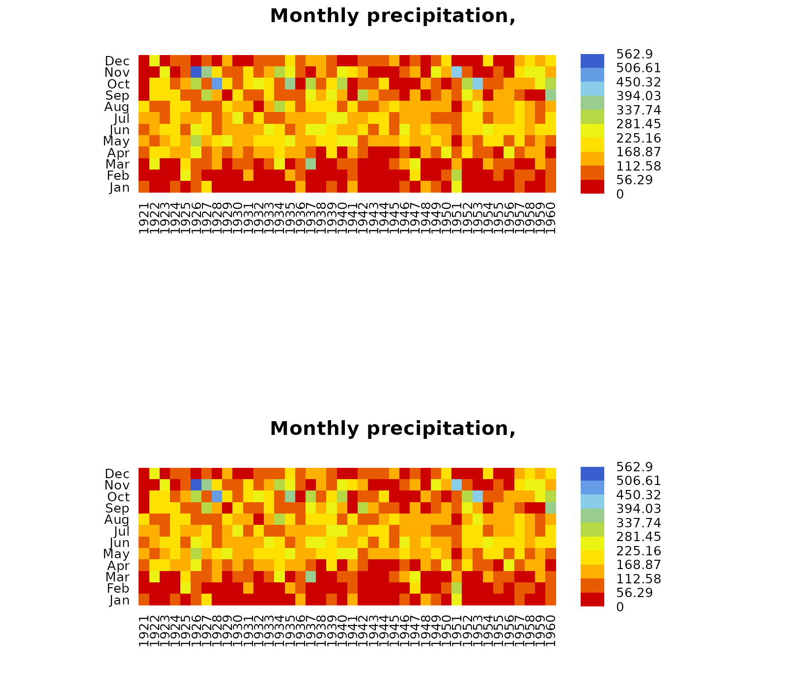

The second and easier way allows you to obtain the same previous figure
(not shown here), but you are required to install the `gridExtra`
package:

``` r
if (!require(gridExtra)) install.packages("gridExtra")
```

    ## Loading required package: gridExtra

``` r
require(gridExtra) # also loads grid
require(lattice)
```

    ## Loading required package: lattice

``` r
grid.arrange(p, p, nrow=2)
```


